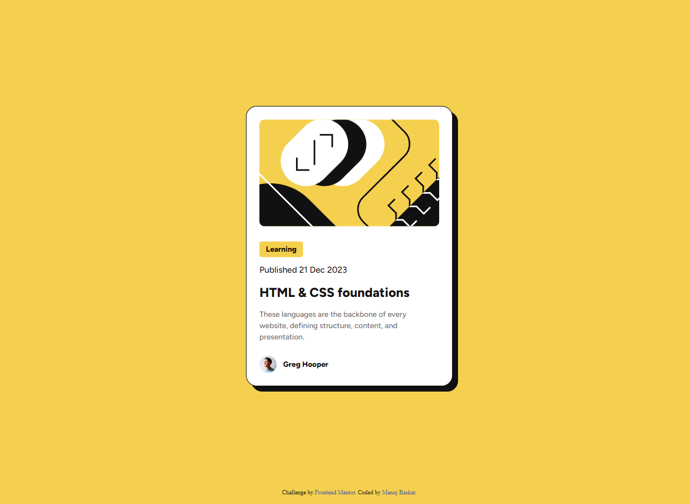

# Frontend Mentor - Blog preview card solution

This is a solution to the [Blog preview card challenge on Frontend Mentor](https://www.frontendmentor.io/challenges/blog-preview-card-ckPaj01IcS). Frontend Mentor challenges help you improve your coding skills by building realistic projects. 

## Table of contents

- [Overview](#overview)
  - [The challenge](#the-challenge)
  - [Screenshot](#screenshot)
  - [Links](#links)
- [My process](#my-process)
  - [Built with](#built-with)
  - [What I learned](#what-i-learned)
  - [Continued development](#continued-development)
  - [Useful resources](#useful-resources)
- [Author](#author)
- [Acknowledgments](#acknowledgments)

## Overview

### The challenge

Users should be able to:

- See hover and focus states for all interactive elements on the page

### Screenshot

### Links

- Solution URL: [Add solution URL here](https://github.com/manojaba/blog-preview-card)
- Live Site URL: [Add live site URL here](https://manojaba.github.io/blog-preview-card/)

## My process

Built the semantic markup following the design layers and nesting followed by styling the elements in order from top to bottom forseeing details in each section.

### Built with

- Semantic HTML5 markup
- CSS custom properties
- Flexbox

### What I learned

learnt how to positiojn the card using flexbox, learnt how to use variable fonts and custom css properties for setting up general styling like color.

### Continued development

I would like to focus more on understanding initial css rule setup * properties and in depth understanding of flexbox and grid.

### Useful resources

- [Example resource 1](https://wakamaifondue.com/) - This page helped me to understand about variable fonts and its font-style properties..
- [Example resource 2](https://css-tricks.com/snippets/css/a-guide-to-flexbox/) - This page helped me to quickly glance the flexbox properties to position the card.

## Author

- github - [Manoj Baskar](https://github.com/manojaba)
- Frontend Mentor - [@manojaba](https://www.frontendmentor.io/profile/manojaba)
- linkedin - [@Manoj Baskar](https://www.linkedin.com/in/manoj-baskar-42a734159/)

## Acknowledgments

I would like to mention and convey my jhuge thanks to Sabine Emden. I referenced Sabine Emden's solution to understand how to position the card.

